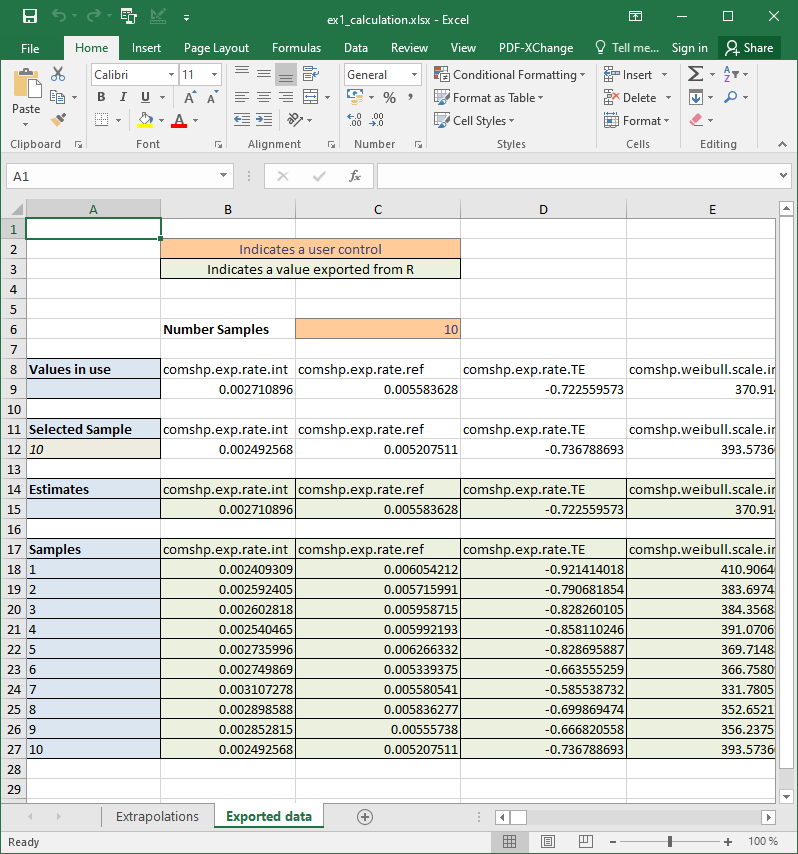
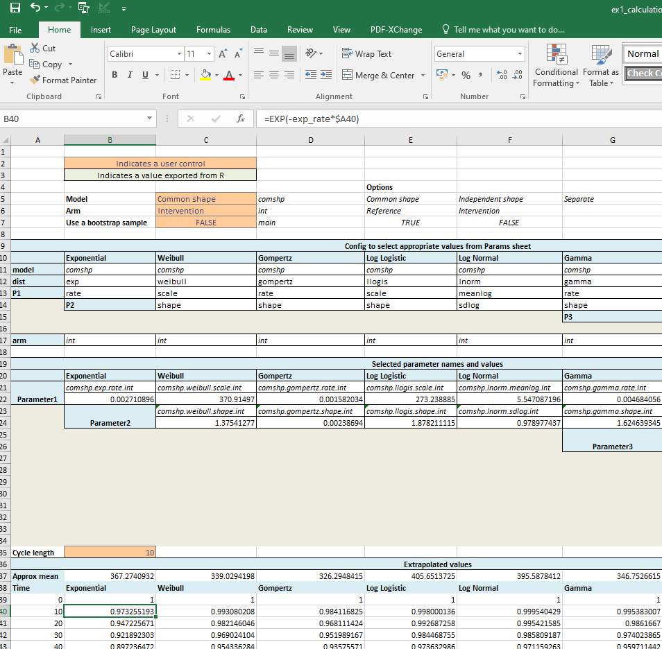

  
```{r, include = FALSE}
knitr::opts_chunk$set(
  collapse = TRUE,
  comment = "#>",
  fig.width = 7,
  fig.height = 6,
  message = FALSE
)
```

<style type="text/css">
  
  body{ /* Normal  */
      font-size: 14px;
  }
td {  /* Table  */
    font-size: 10px;
}
h1.title {
  font-size: 38px;
}
h1 { /* Header 1 */
    font-size: 28px;
}
h2 { /* Header 2 */
    font-size: 22px;
}
h3 { /* Header 3 */
    font-size: 18px;
}
code.r{ /* Code block */
    font-size: 12px;
}
pre { /* Code block - determines code spacing between lines */
    font-size: 14px;
}
</style>
  
# Introduction

This vignette describes how to work with the included example excel templates that are 
compatible to the survival models estimated with flexsurvPlus. These examples are
deliberately simple and are intended to illustrate calculations in excel rather than as a 
basis for a real economic model. In this example the basic calculations needed to extrapolate 
survival are illustrated.

# Set up packages and data

## Install packages

The following packages are required to run this example:
  
```{r setup}
rm(list = ls())
# Libraries
library(flexsurvPlus)
library(tibble)
library(dplyr)
library(boot)
library(ggplot2)
```

## Generate the data

To perform survival analyses, patient level data is required for the survival
endpoints. In this example, we analyze progression-free survival (PFS). For more 
details on these steps please refer to the other vignettes.

```{r}

# make reproducible
set.seed(1234)

# used later 
(simulation_seed <- floor(runif(1, min=1, max = 10^8)))
(bootstrap_seed <- floor(runif(1, min=1, max = 10^8)))

# low number for speed of execution given illustrating concept
n_bootstrap <- 10

adtte <- sim_adtte(seed = simulation_seed)
head(adtte)

# subset PFS data and rename
PFS_data <- adtte %>%
  filter(PARAMCD=="PFS") %>%
  transmute(USUBJID,
            ARMCD,
            PFS_days = AVAL,
            PFS_event = 1- CNSR
  )


```

# Fitting the models

More information about each function can be used by running the code <tt>?runPSM</tt> or viewing the other vignettes. 

```{r}
psm_PFS_all <- runPSM(data=PFS_data,
                     time_var="PFS_days",
                     event_var="PFS_event",
                     model.type= c("Common shape", 
                                   "Independent shape", 
                                   "Separate"),
                     distr = c('exp',
                               'weibull',
                               'gompertz',
                               'lnorm',
                               'llogis',
                               'gengamma',
                               'gamma',
                               'genf'),
                     strata_var = "ARMCD",
                     int_name = "B",
                     ref_name = "A")

```
# Bootstrap the estimated parameters

As described in other vignettes we can use `boot` to explore uncertainty.

```{r message=FALSE}
# fix seed for reproducible samples
set.seed(bootstrap_seed)

boot_psm_PFS_all <- do.call(boot, args = c(psm_PFS_all$config, statistic = bootPSM, R = n_bootstrap))

```
# Exporting to Excel

Once the values are calculated we can export to Excel. The following code prepares two tibbles that can be exported. One containing the main estimates. A second containing the bootstrap samples.

```{r}

main_estimates <- psm_PFS_all$parameters_vector %>%
  t() %>%
  as.data.frame()


boot_estimates <- boot_psm_PFS_all$t %>%
  as.data.frame() 

colnames(main_estimates) <- colnames(boot_estimates) <- names(psm_PFS_all$parameters_vector)

# can preview these tables
  
main_estimates[,1:5] %>%
  pander::pandoc.table()

boot_estimates[1:3,1:5] %>%
  pander::pandoc.table()

# the following code is not run in the vignette but will export this file 

# require(openxlsx)
# wb <- openxlsx::createWorkbook()
# openxlsx::addWorksheet(wb, sheetName = "Exported data") 
# openxlsx::writeDataTable(wb, sheet = "Exported data", main_estimates, startRow = 2, startCol = 2)
# openxlsx::writeDataTable(wb, sheet = "Exported data", boot_estimates, startRow = 5, startCol = 2)
# openxlsx::createNamedRegion(wb, sheet = "Exported data", 
#                             cols = 2:(2+length(main_estimates)), rows = 3, name = "Estimates")
# openxlsx::createNamedRegion(wb, sheet = "Exported data", 
#                             cols = 2:(2+length(main_estimates)), rows = 6:(6-1+nrow(boot_estimates)), name = "Samples")
# openxlsx::saveWorkbook(wb, file = "export_data.xlsx", overwrite = TRUE)

```

# The Excel model

Included with the package is an example Excel file called `ex1_calculation.xlsx`. This can be extracted using the below code (not run). It can also be found in the github repository at https://github.com/Roche/flexsurvPlus/tree/main/inst/extdata

```{r}

installed_file <- system.file("extdata/ex1_calculation.xlsx", package = "flexsurvPlus") 
installed_file

# not run but will give you a local copy of the file
# file.copy(from = installed_file, to ="copy_of_ex1_calculation.xlsx")

```

This illustrates how all the included survival models can be extrapolated in Excel.

## Exported data tab

This contains a copy of the data exported in the last step.



## Extrapolations tab

This contains example calculations to extrapolate survival.





We can compare the approximate estimates of mean survival with those calculated in R. As the excel model only goes until time t=2000 we can more directly compare to the estimates of restricted mean survival time (rmst) until this time.

```{r}

means_est <- psm_PFS_all %>%
  summaryPSM(type = c("mean","rmst"), t = 2000) 

# match to selected model in screenshot
means_est %>%
  dplyr::filter(Model == "Common shape", Strata=="Intervention") %>%
  tidyr::pivot_wider(id_cols = c("Dist"),
                          names_from = c("type"),
                          values_from = "value") %>%
  pander::pandoc.table()

```
