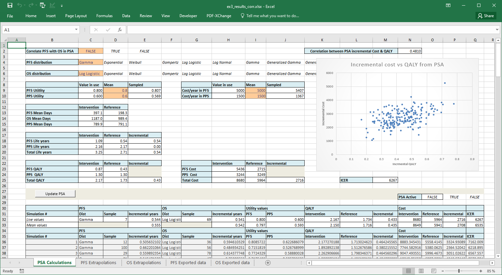

  
```{r, include = FALSE}
knitr::opts_chunk$set(
  collapse = TRUE,
  comment = "#>",
  fig.width = 7,
  fig.height = 6,
  message = FALSE
)
```

<style type="text/css">
  
  body{ /* Normal  */
      font-size: 14px;
  }
td {  /* Table  */
    font-size: 10px;
}
h1.title {
  font-size: 38px;
}
h1 { /* Header 1 */
    font-size: 28px;
}
h2 { /* Header 2 */
    font-size: 22px;
}
h3 { /* Header 3 */
    font-size: 18px;
}
code.r{ /* Code block */
    font-size: 12px;
}
pre { /* Code block - determines code spacing between lines */
    font-size: 14px;
}
</style>
  
# Introduction

This vignette describes how to work with the included example excel templates that are 
compatible to the survival models estimated with flexsurvPlus. These examples are
deliberately simple and are intended to illustrate calculations in excel rather than as a 
basis for a real economic model. In this example correlated endpoints are implemented in excel.

# Set up packages and data

## Install packages

The following packages are required to run this example:
  
```{r setup}
rm(list = ls())
# Libraries
library(flexsurvPlus)
library(tibble)
library(dplyr)
library(boot)
library(ggplot2)
```

## Generate the data

To perform survival analyses, patient level data is required for the survival
endpoints. In this example, we analyze progression-free survival (PFS) 
and overall survival (OS). For more  details on these steps please refer to the other vignettes.

```{r}

# make reproducible
set.seed(1234)

# used later 
(simulation_seed <- floor(runif(1, min=1, max = 10^8)))
(bootstrap_seed <- floor(runif(1, min=1, max = 10^8)))

# low number for speed of execution given illustrating concept
n_bootstrap <- 100

adtte <- sim_adtte(seed = simulation_seed, rho = 0.6)

# subset PFS data and rename
PFS_data <- adtte %>%
  filter(PARAMCD=="PFS") %>%
  transmute(USUBJID,
            ARMCD,
            PFS_days = AVAL,
            PFS_event = 1- CNSR
  )

# subset PFS data and rename
OS_data <- adtte %>%
  filter(PARAMCD=="OS") %>%
  transmute(USUBJID,
            ARMCD,
            OS_days = AVAL,
            OS_event = 1- CNSR
  )

OSPFS_data <- PFS_data %>%
  left_join(OS_data, by = c("USUBJID", "ARMCD"))

head(OSPFS_data)


```

# Fitting the models

More information about each function can be used by running the code <tt>?runPSM</tt> or viewing the other vignettes. Here only common shape models are fit but the same concept applies to all other models.

```{r}
psm_PFS_all <- runPSM(data=OSPFS_data,
                     time_var="PFS_days",
                     event_var="PFS_event",
                     model.type= c("Common shape"),
                     distr = c('exp',
                               'weibull',
                               'gompertz',
                               'lnorm',
                               'llogis',
                               'gengamma',
                               'gamma',
                               'genf'),
                     strata_var = "ARMCD",
                     int_name = "B",
                     ref_name = "A")


psm_OS_all <- runPSM(data=OSPFS_data,
                     time_var="OS_days",
                     event_var="OS_event",
                     model.type= c("Common shape"),
                     distr = c('exp',
                               'weibull',
                               'gompertz',
                               'lnorm',
                               'llogis',
                               'gengamma',
                               'gamma',
                               'genf'),
                     strata_var = "ARMCD",
                     int_name = "B",
                     ref_name = "A")


```
# Bootstrap the estimated parameters

As described in other vignettes we can use `boot` to explore uncertainty. We can also reuse the seed to maintain correlations by ensuring the same individuals are sampled across each endpoint

```{r message=FALSE}
# fix seed for reproducible samples
set.seed(bootstrap_seed)

boot_psm_PFS_all <- do.call(boot, args = c(psm_PFS_all$config, statistic = bootPSM, R = n_bootstrap))

# reuse the seed to maintain correlations
set.seed(bootstrap_seed)

boot_psm_OS_all <- do.call(boot, args = c(psm_OS_all$config, statistic = bootPSM, R = n_bootstrap))

```
# Exporting to Excel

Once the values are calculated we can export to Excel. The following code prepares four tibbles that can be exported. Two containing the main estimates for PFS & OS respectively. And two more containing the bootstrap samples.

```{r}

main_estimates_PFS <- psm_PFS_all$parameters_vector %>%
  t() %>%
  as.data.frame()

main_estimates_OS <- psm_OS_all$parameters_vector %>%
  t() %>%
  as.data.frame()

boot_estimates_PFS <- boot_psm_PFS_all$t %>%
  as.data.frame() 

boot_estimates_OS <- boot_psm_OS_all$t %>%
  as.data.frame() 

colnames(main_estimates_PFS) <- colnames(boot_estimates_PFS) <- names(psm_PFS_all$parameters_vector)

colnames(main_estimates_OS) <- colnames(boot_estimates_OS) <- names(psm_OS_all$parameters_vector)

# can preview these tables
  
main_estimates_PFS[,1:5] %>%
  pander::pandoc.table()

# the following code is not run in the vignette but will export this file 

# require(openxlsx)
# wb <- openxlsx::createWorkbook()
# openxlsx::addWorksheet(wb, sheetName = "PFS Exported data")
# openxlsx::writeDataTable(wb, sheet = "PFS Exported data", main_estimates_PFS, startRow = 2, startCol = 3)
# openxlsx::writeDataTable(wb, sheet = "PFS Exported data", boot_estimates_PFS, startRow = 5, startCol = 2, rowNames = TRUE)
# openxlsx::createNamedRegion(wb, sheet = "PFS Exported data",
#                             cols = 2:(2+length(main_estimates_PFS)), rows = 3, name = "PFS_Estimates")
# openxlsx::createNamedRegion(wb, sheet = "PFS Exported data",
#                             cols = 2:(2+length(main_estimates_PFS)), rows = 6:(6-1+nrow(boot_estimates_PFS)), name = "PFS_Samples")
# openxlsx::addWorksheet(wb, sheetName = "OS Exported data")
# openxlsx::writeDataTable(wb, sheet = "OS Exported data", main_estimates_OS, startRow = 2, startCol = 3)
# openxlsx::writeDataTable(wb, sheet = "OS Exported data", boot_estimates_OS, startRow = 5, startCol = 2, rowNames = TRUE)
# openxlsx::createNamedRegion(wb, sheet = "OS Exported data",
#                             cols = 2:(2+length(main_estimates_OS)), rows = 3, name = "OS_Estimates")
# openxlsx::createNamedRegion(wb, sheet = "OS Exported data",
#                             cols = 2:(2+length(main_estimates_OS)), rows = 6:(6-1+nrow(boot_estimates_OS)), name = "OS_Samples")
# openxlsx::saveWorkbook(wb, file = "export_data.xlsx", overwrite = TRUE)


```

# The Excel model

Included with the package is an example Excel file called `ex3_correlation.xlsm`. This can be extracted using the below code (not run). It can also be found in the github repository at https://github.com/Roche/flexsurvPlus/tree/main/inst/extdata. Also included are two files with pre calculated results for correlated and un-correlated PSA and excluding the excel PSA macro. These are `ex3_results_corr.xlsx` for correlated PSA and `ex3_results_not.xlsx` for un-correlated.

```{r}

installed_file <- system.file("extdata/ex3_correlation.xlsm", package = "flexsurvPlus") 
installed_file

# not run but will give you a local copy of the file
# file.copy(from = installed_file, to ="ex3_correlation.xlsm")

```

This illustrates how all the included survival models can be extrapolated in Excel and PSA setup to correlate two outcomes.

## Results ignoring correlation

This shows the results of the PSA when correlation between PFS & OS distributions is ignored in the PSA.



## Results accounting for correlation

This shows the results of the PSA when correlation between PFS & OS distributions is included in the PSA through the use of jointly sampled distributions.


